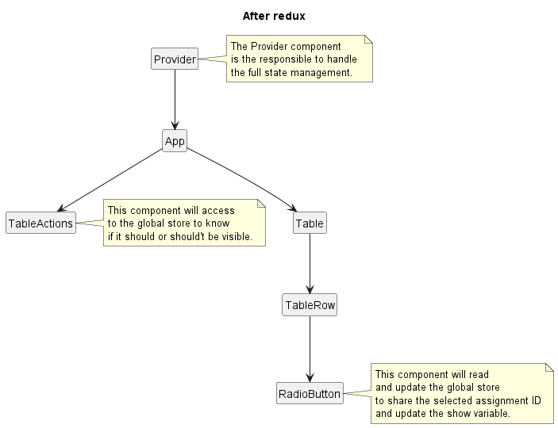

# Redux

## App component tree without redux


## App component tree with redux


## Create a slice using `js`

1. Create a feature file describing the slice name.
     ```bash
    touch feature/assignmentSlice.js
    ```
2. Define an initial state.
    ```js
    const initialState = {
        showActions: false,
        assignmentId: null
    }
    ```
3. Define the name, initialState and reducers from the slice.
    ```js
    import { createSlice } from '@reduxjs/toolkit'
   
    const assignmentSlice = createSlice({
        name: 'assignmentTable',
        initialState,
        reducers: {
            show: (state, action) => {
                state.showActions = true
                state.assignmentId = context.payload
            },
            hide: (state) => {
                state.showActions = false
            }
        }
    })
    ```
4. Export the slice actions. 
    ```js
    export const { hide, show } = assignmentSlice.actions
    ```

5. Export the slice reducer.
    ```js
    export default assignmentSlice.reducer
    ```

6. Add the reducer to the `store.reducer` definition.
    ```js
    import assignmentSliceReducer from './feature/assignmentSlice'
    
    const store = configureStore({
        reducer: {
            assignment: assignmentSliceReducer
        }
    })
    ```
   

## Using a slice
1. Read the state.
    ```js
    import { useSelector } from 'react-redux'
   
    const MyComponent = () => {
        const showActions = useSelector((state) => state.assignment.showActions)
   
        return <p> The showActions value is {showActions}</p>
    }
   
    export default MyComponent
    ```
2. Call actions.
    ```js
    import { useDispatch } from 'react-redux'
    import { show, hide } from './feature/assignmentSlice'
   
    const MyComponent = () => {
        const dispatch = useDispatch()
   
        return (
            <>
                <button onClick={() => dispatch(show(1))}>Show with payload</button>
                <button onClick={() => dispatch(hide())}>Hide</button>
            </>
        )    
    }
   
    export default MyComponent
    ```


# Typescript considerations
- Ensure to create a type or interface for the initial state of your slice.
```ts
interface InitialState {
    showActions: boolean,
    assignmentId: number|null
}
```
- When you export your store, ensure to define the root state type, it can be easily done by inferring it 
```ts
    const store = configureStore({/*...*/})
    export type RootState = ReturnType<typeof store.getState>
    export type AppDispatch = typeof store.dispatch
```
- Use the root types to have autocompletion
```ts
import React from 'react'
import { useSelector } from 'react-redux'
import { RootState } from '../store'

const MyComponent = () => {
  const showActions = useSelector((state: RootState) => state.tableAction.showActions)
    /*...*/
}

export default MyComponent
```